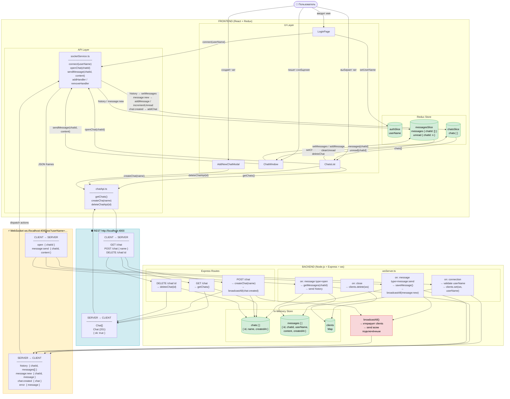
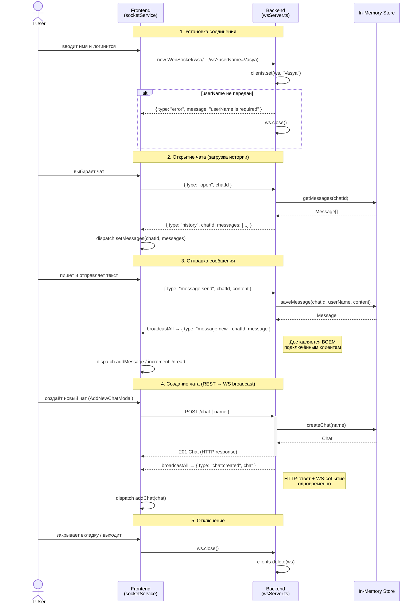

# Data Flow Diagram — Messenger

## Общая схема (WebSocket + REST)

---

## WebSocket: детальный поток событий

---

## Типы WebSocket-событий

| Направление | Тип события | Поля | Триггер |
|---|---|---|---|
| Client → Server | `open` | `chatId` | Пользователь открывает чат |
| Client → Server | `message:send` | `chatId`, `content` | Пользователь отправляет сообщение |
| Server → Client | `history` | `chatId`, `messages[]` | Ответ на `open` |
| Server → Client | `message:new` | `chatId`, `message` | Broadcast при сохранении сообщения |
| Server → Client | `chat:created` | `chat` | Broadcast при `POST /chat` |
| Server → Client | `error` | `message` | Ошибка валидации / сервера |
